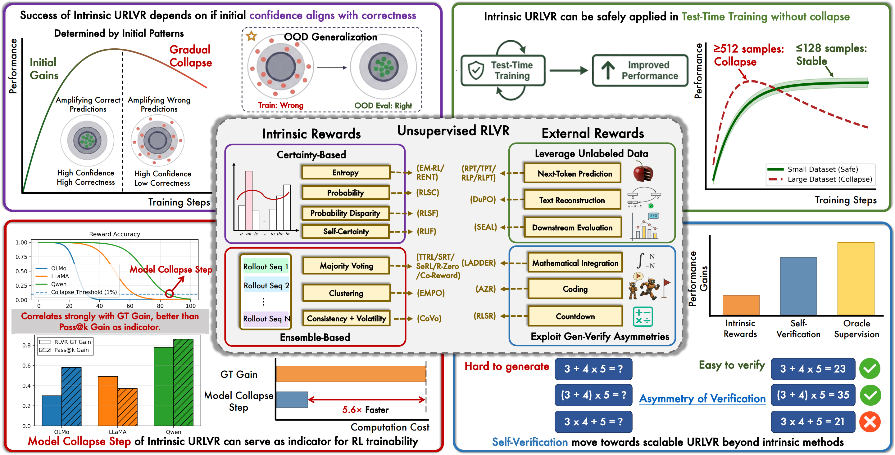
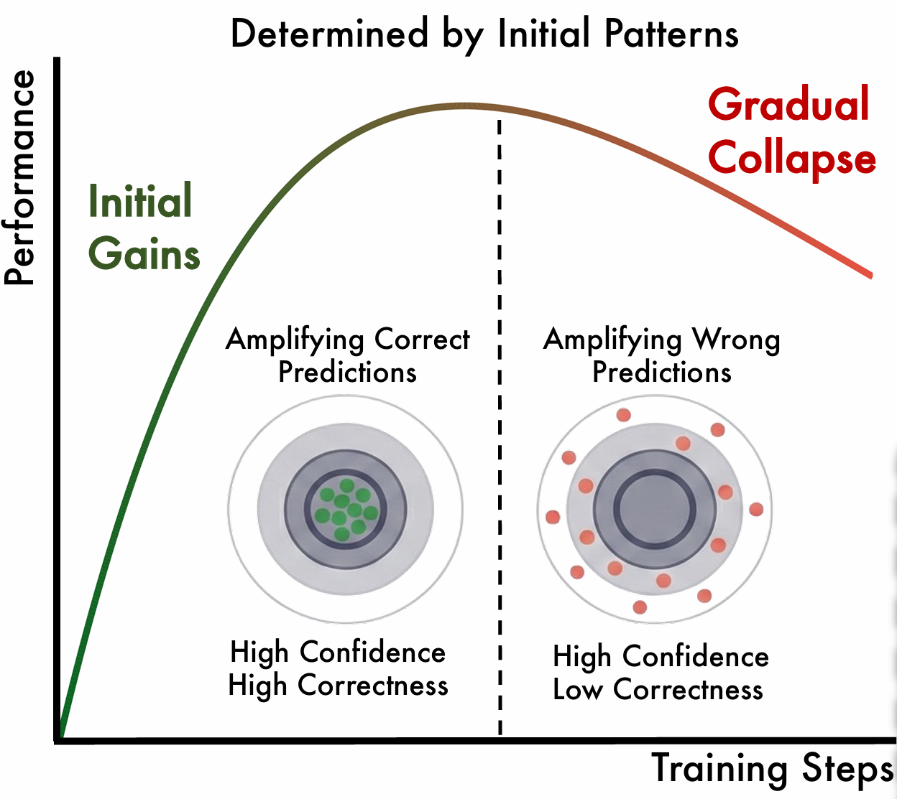
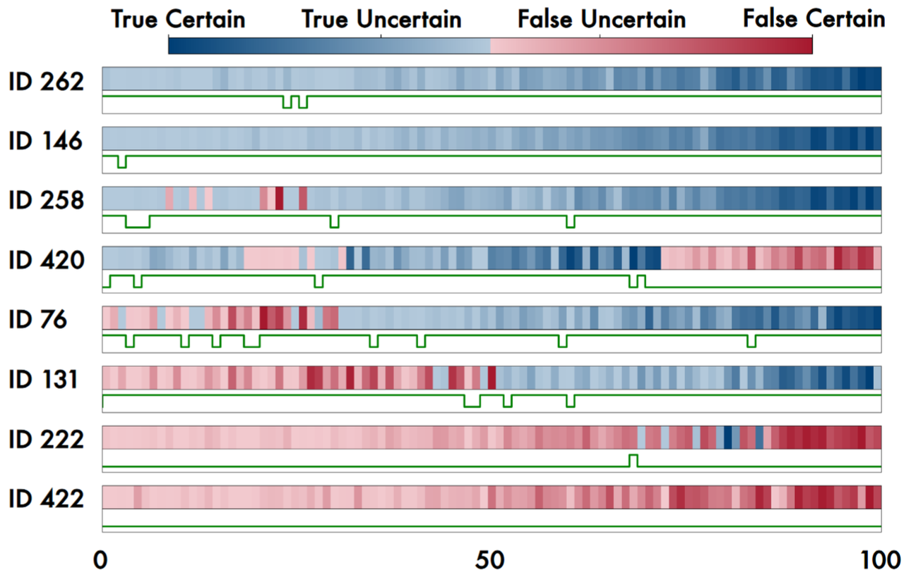
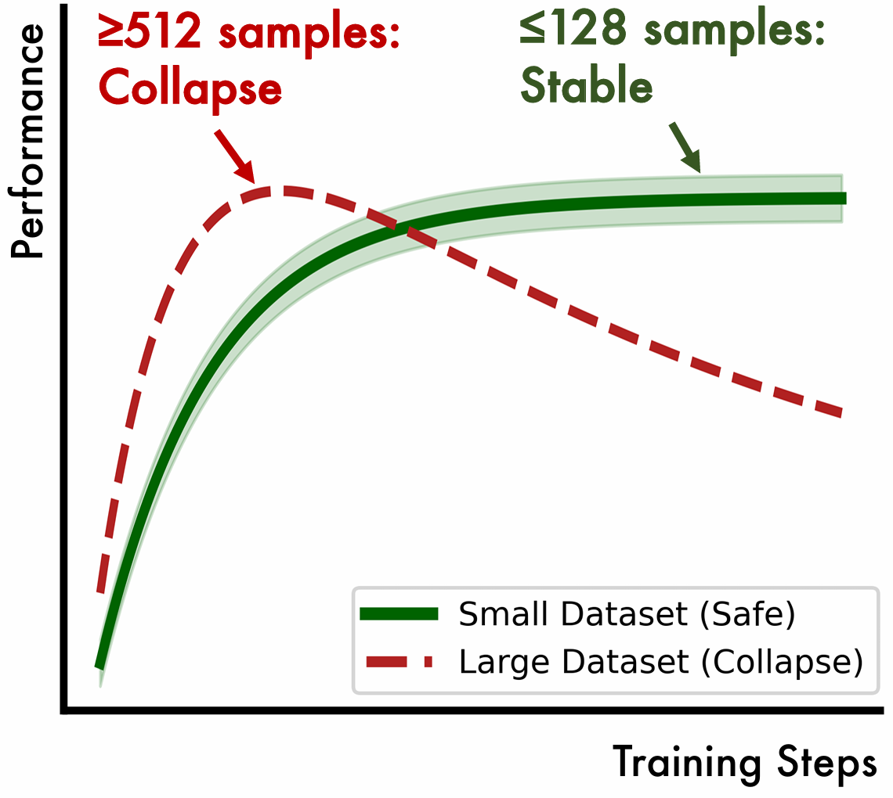
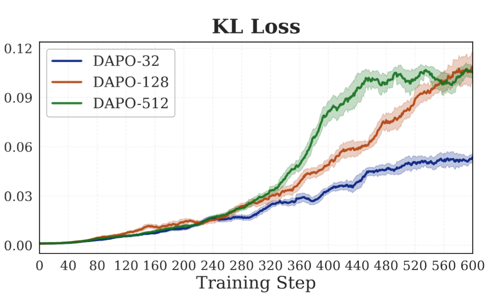
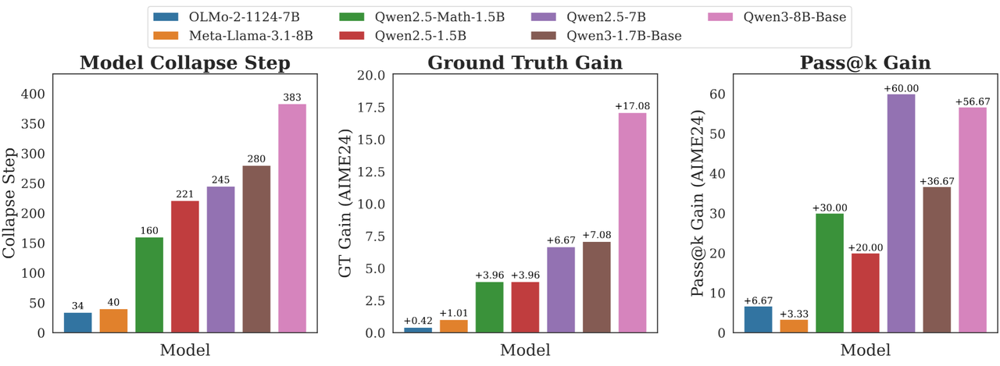
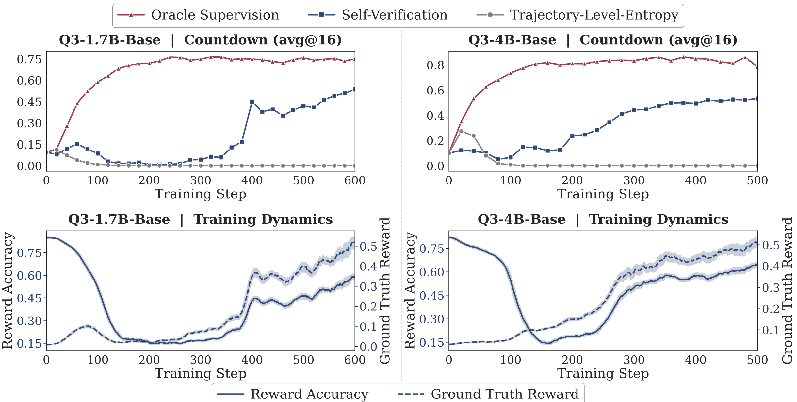

<div align="center">

# How Far Can Unsupervised RLVR Scale LLM Training?

[](https://arxiv.org/abs/2603.08660)  [](https://github.com/PRIME-RL/TTRL/tree/urlvr-dev)  [](https://huggingface.co/papers/2603.08660)  [](https://x.com/HBX_hbx/status/2031406636930338828)

</div>

<div align="center" style="font-family: Arial, sans-serif;">
  <p>
    <a href="#introduction" style="text-decoration: none; font-weight: bold;">📖 Introduction</a> •
    <a href="#key-findings" style="text-decoration: none; font-weight: bold;">🔍 Key Findings</a>
  </p>
  <p>
    <a href="#getting-started" style="text-decoration: none; font-weight: bold;">✨ Getting Started</a> •
    <a href="#contact" style="text-decoration: none; font-weight: bold;">📨 Contact</a> •
    <a href="#citation" style="text-decoration: none; font-weight: bold;">🎈 Citation</a> •
    <a href="#star-history" style="text-decoration: none; font-weight: bold;">🌟 Star History</a>
  </p>
</div>

We investigate the mechanisms and potential applications of [Unsupervised RLVR (URLVR)](https://arxiv.org/pdf/2603.08660), and find that it is particularly well suited for test-time training and quantifying model priors. URLVR paper is accepted to [ICLR 2026](https://iclr.cc/Conferences/2026)!

# 📖Introduction

**Can LLMs truly improve without human supervision? We provide the first systematic answer.**

Reinforcement learning with verifiable rewards (RLVR) has driven recent breakthroughs in LLM reasoning, but scaling supervision is costly and increasingly infeasible as models approach human-level expertise.

**Unsupervised RLVR (URLVR)** promises a solution that derive rewards without ground truth labels, just as pretraining scaled intelligence on unlabeled data. Recent works have explored using intrinsic model signals (majority voting, entropy, self-consistency) as rewards for unsupervised reinforcement learning. While showing promising early gains, their scalability limits remain unclear.

<p align="center">
   
</p>


# 🔍Key Findings

## When Does Intrinsic URLVR Work?

Intrinsic URLVR universally follows a **rise-then-fall** pattern across all methods. Early gains reflect **confidence-correctness alignment** in the model's prior, while eventual collapse is inevitable when this alignment breaks down.

<p align="center">
   
   
</p>

## How Can Sharpening from Intrinsic URLVR Be Applied Safely?

Small datasets induce localized rather than systematic policy shift, even training on wrong problems can yield gains, making **test-time training** a safe and practical application.

<p align="center">
   
   
</p>

## How Can We Measure Model Prior?

We propose the **Model Collapse Step** as a novel indicator of model priors, which measures standard RL trainability by tracking reward accuracy collapses during intrinsic URLVR. This indicator **achieves accuracy in assessing trainability on par with running standard RL itself**, but with higher efficiency (5.6x faster); it **outperforms pass@k**, requires no ground-truth labels and remains robust to multiple-choice problems.

<p align="center">
   
</p>

## The real scalable direction: external rewards

Intrinsic rewards are fundamentally bounded by what the model already knows. External rewards grounded in unlabeled data or generation-verification asymmetry provide signals that scale with data and computation rather than saturating with model capacity, offering a more promising path towards scalable URLVR.

<p align="center">
   
</p>

# ✨Getting Started

URLVR extends TTRL with additional unsupervised reward mechanisms for reinforcement learning without ground-truth labels. The implementation supports three main approaches:

- **Ensemble-based:** Majority voting (similar to TTRL's core method)
- **Certainty-based:** Rewards derived from model's internal certainty metrics, including self_certainty, token_level_entropy, trajectory_level_entropy and probability methods.
- **Self-verification:** Model-based verification of generated solutions

## Environment Setup

```bash
git clone -b urlvr-dev https://github.com/PRIME-RL/TTRL
cd TTRL/verl

conda create -n urlvr python==3.10
conda activate urlvr
bash scripts/install_ttrl_deps.sh
pip install -e .
```

## Running URLVR Methods

All URLVR scripts are located in `verl/examples/unsupervised_rlvr`. Before running, update the following in each script:

1. Set your model path: `export ACTOR_MODEL_PATH=path/to/your/model`
2. Set the project path: `export PROJECT_PATH=path/to/TTRL/verl`
3. Set your WandB API key: `export WANDB_API_KEY=<wandb_api_key>`

### Ensemble-based (Majority Voting)

```bash
bash examples/unsupervised_rlvr/ensemble-based.sh
```

This method uses majority voting to generate ground truth labels, similar to TTRL's core approach.

### Certainty-based

```bash
bash examples/unsupervised_rlvr/certainty-based.sh
```

This method computes rewards based on model certainty metrics. You can configure the estimator type:
- `self_certainty`: Self-certainty scores from logits
- `token_level_entropy`: Token-level entropy
- `trajectory_level_entropy`: Trajectory-level entropy
- `probability`: Probability-based metrics

Modify the `REWARD_TYPE` environment variable in the script to change the estimator.

### Self-verify

```bash
bash examples/unsupervised_rlvr/self-verify.sh
```

This method uses the model itself to verify generated solutions and assign rewards.

### Ground Truth Baseline

```bash
bash examples/unsupervised_rlvr/gt.sh
```

Baseline using ground truth labels (for comparison).

## Configuration

URLVR methods are configured through the `ppo_trainer_ttrl.yaml` config file. Key parameters:

```yaml
unsupervised_reward:
  # Whether to enable unsupervised reward (extends TTRL with more methods)
  enable: False

  # The type of unsupervised reward: "ensemble", "certainty" or "external"
  type: "ensemble"

  # Estimator for certainty reward: "self_certainty", "token_level_entropy", "trajectory_level_entropy", "probability", "majority_voting", "self_verify"
  estimator: "majority_voting"
```

## Notes

- All experiments were conducted on 8 x NVIDIA A800 80GB GPUs
- The code automatically handles the correct order of reward and log probability computation for each method
- TTRL and URLVR methods can be used independently. They are properly separated in the codebase
- For data preprocessing, use `verl/data/preprocess.py` to convert JSON to Parquet format

# 📨Contact

- Bingxiang He: hebx24@mails.tsinghua.edu.cn
- Ning Ding: dingning@mail.tsinghua.edu.cn

# 🎈Citation

If you find URLVR helpful, please cite:
```bibtex
@misc{he2026farunsupervisedrlvrscale,
      title={How Far Can Unsupervised RLVR Scale LLM Training?}, 
      author={Bingxiang He and Yuxin Zuo and Zeyuan Liu and Shangziqi Zhao and Zixuan Fu and Junlin Yang and Cheng Qian and Kaiyan Zhang and Yuchen Fan and Ganqu Cui and Xiusi Chen and Youbang Sun and Xingtai Lv and Xuekai Zhu and Li Sheng and Ran Li and Huan-ang Gao and Yuchen Zhang and Bowen Zhou and Zhiyuan Liu and Ning Ding},
      year={2026},
      eprint={2603.08660},
      archivePrefix={arXiv},
      primaryClass={cs.LG},
      url={https://arxiv.org/abs/2603.08660}, 
}
```

# 🌟Star History

[](https://www.star-history.com/#PRIME-RL/TTRL&Date)

---

<div align="center">
<b>Understanding the boundaries of unsupervised RLVR is the first step toward transcending them.</b>
</div>